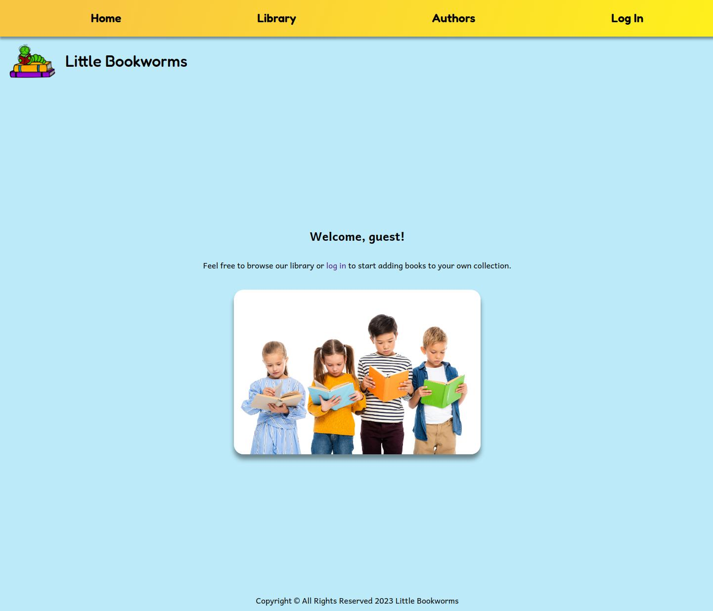
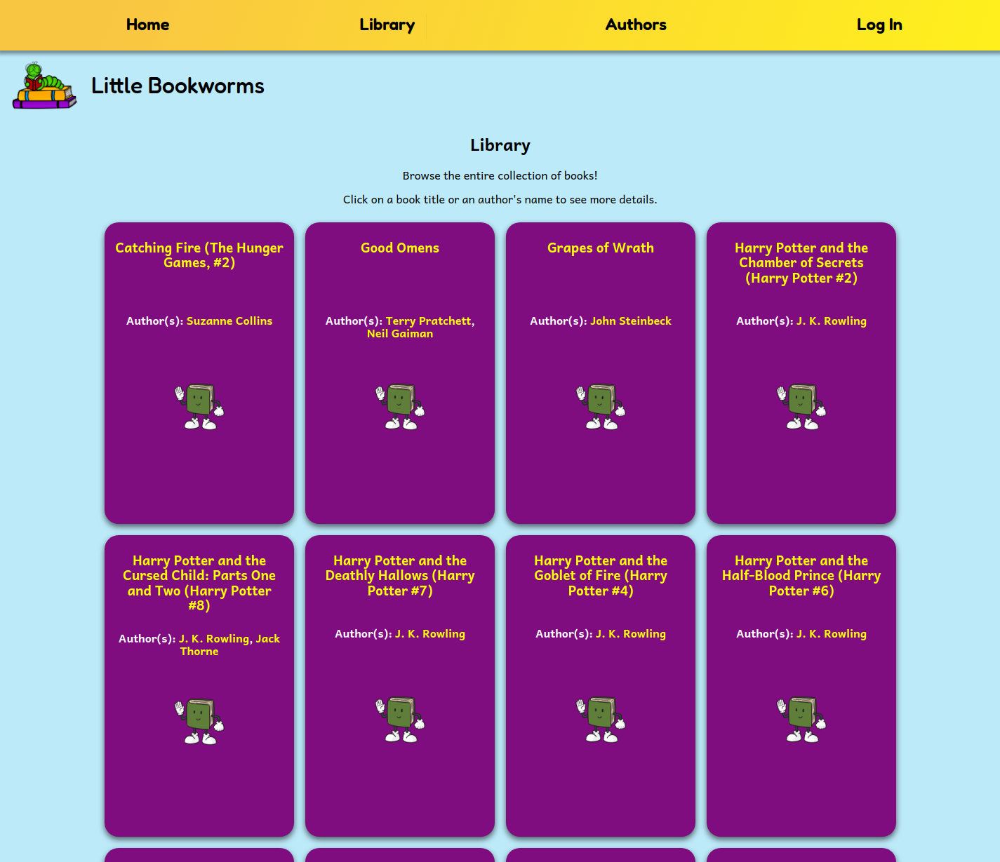
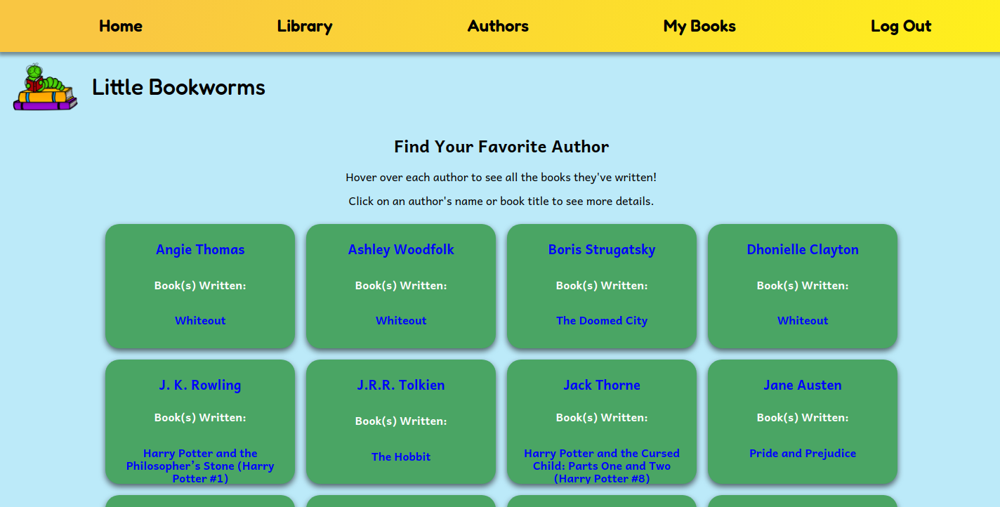
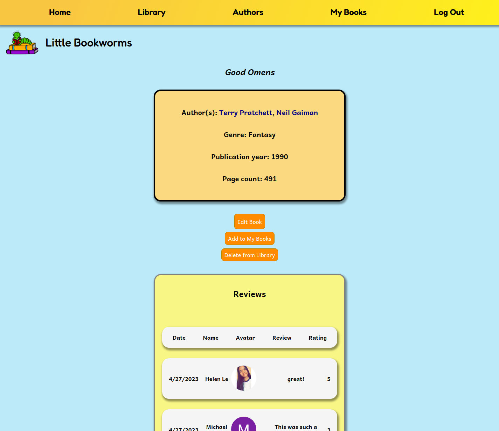
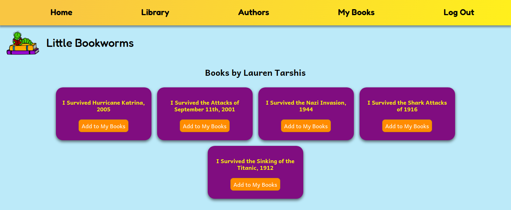
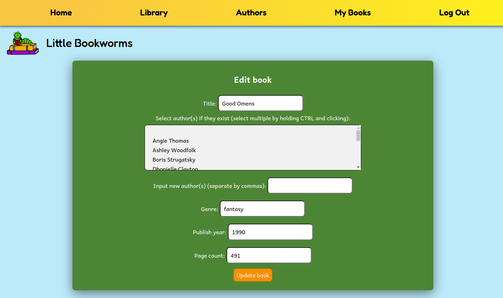
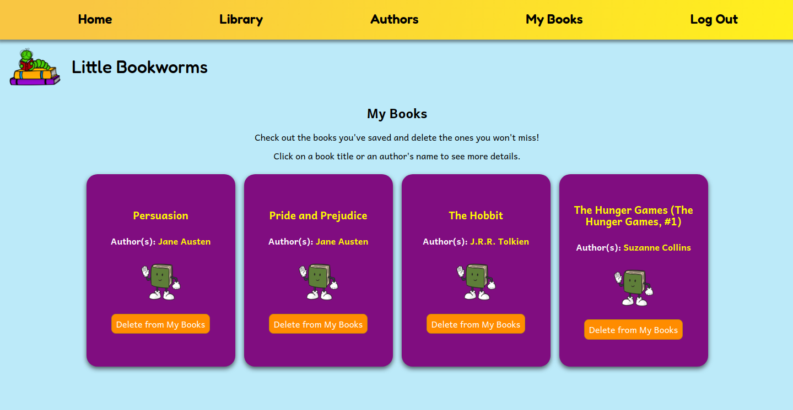

<h1 align="center">Little Bookworms - Home Library</h1>

<!-- TABLE OF CONTENTS -->

  
Table of Contents

  <ol>
    <li><a href="#background">Background</a></li>
    <li><a href="#screenshots">Screenshots</a></li>
    <li><a href="#technologies-used">Technologies Used</li>
    <li><a href="#getting-started">Play the Game</a></li>
    <li><a href="#next-steps">Next Steps</a></li>
  </ol>

## Background

Do you have a ton of books at home and have trouble keeping track of what you've read?
Maybe your kids or partner or roommates keep choosing the same book to read and you want to recommend something new?

Little Bookworms is a home library application designed for adults and children alike.
In each instance of the application, an admin user (probably you, if you're reading this!) takes care of keeping the library updated by creating, updating, or deleting a book. An authenticated user (probably your kid/partner/roommate) can add or delete books from their own collection. Guest users can peruse the books at the library at their leisure.

Authenticated users can also leave reviews of books they've read and see others' reviews. You can see when your kid leaves a 1-star rating on that book you recommended them!

## Screenshots

## Technologies Used

- JavaScript
- Node.js (Express)
- MongoDB (Mongoose)
- HTML (EJS)
- CSS

## Getting Started

- [Trello board](https://trello.com/b/dAFx0NL1/library-project)

## Next Steps

- Access additional book information and populate library via a books API.
- Allow user to search for the books. (For now, you can use `CTRL + F`, for example.)
- Allow admin user to upload a cover picture for the book when adding to library.

Feel free to submit a pull request if you would like to suggest any changes!
